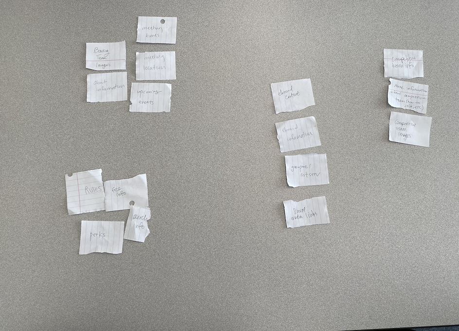

# Group Project: Design Journey

**You are encouraged to work ahead on everything on this project.** (Though we suggest you hold back on the
interactivity until Project 3.) **Each section is required for a specific milestone. You are required to have these
sections completed before that milestone's deadline.**

**Be clear and concise in your writing.** Bullets points are encouraged.

**Everything, including images, must be visible in Markdown Preview.** If it's not visible in Markdown Preview, then we
won't grade it. We won't give you partial credit either. This is your warning.

# Client (Milestone 1)

## Client Questionnaire (Milestone 1)

1. Describe your organization and its purpose.


2. What makes your organization and its activities/events unique?


3. Why are you looking for a new website or updating your existing site?


4. Who do you want to visit your site? Who is your site's target audience?


5. When visiting your site, what things do you want your visitors to be able to do?


6. What are your goals for this site?


7. Is there a "feel" that you want for your site? Are there colors or imagery that you have in mind?

8. What are your three favorite competitors or similar organizations' sites? Why?

9. Are you willing to provide us information including images and written content for the website (e.g. logos, team
   photos, bios, etc.)?

10. How often would you like to be updated on the status of the website?

## Client Description (Milestone 1)

> Tell us about your client. Who is your client?
> Explain why your client meets the client rules in the project requirements.

Our client is the Cornell Bowling Club. They are a club that provides a space for players of all skill levels to bowl.

This client meets our client rules in the project requirements because there is no one in our group that is part of the
club or has a close relation to anyone in the club.

## Client Website (Milestone 1)

> Tell us about the website that your client wants. Tell us the purpose of the website and what it is all about.
> NOTE: **If you are redesigning an existing website, give us the current URL and some screenshots of the current site.** (FireFox makes it easy to take a full screenshot of a page.) Tell us how you plan to update the site in a significant way that meets the project's requirements.

The purpose of the website is to inform current and prospective members about club events and logistics. Also to provide
rules and expectations of the club. The website would serve as a central hub for club information and recruitment.

## Client Website Scope (Milestone 1)

> Your project should be ambitious, but not too large. A good rule-of-thumb is that you should have about 1 content-full page for each team member.
> Explain why the website you will create for your client isn't too small and isn't too big. Explain why you think it's the right size for this project.

The content that is important to the organization is limited to the scope of images and written content (photographs,
links, written text). The amount of content will fill at least 4 pages. It is ambitious because in order to meet the
clients goals, there is a lot of content that needs to be organized onto the website. We believe it will be the right
size because we should have about 1 page worth of content for each group member with a variety of elements.

## Client Goals (Milestone 1)

> What kind of website do they want? What are their goals for the site?
> There is no required number of goals. You need as many goals as necessary to reflect your client's desires.

- Goal A: Provide users with information about the club (meeting times, events, competitions, executive board,
  expectations, merchandise, contact).
- Goal B: Emphasize inclusivity-- the club accepts members of all skill/ experience backgrounds.
- Goal C: Recruit new members.

## First Client Meeting Minutes/Notes (Milestone 1)

> Include your notes/minutes from the client meeting.

1. Describe org and purpose

- Bowling club is a sports club on campus that is open to all skill levels of bowlers
- brand new to competitive bowlers who have been bowling their entire lives
- goal of the club is to provide a place for studnets to learn about the sport of bowling and relax after a long day of
  classes
- meet people have a good time

2. What makes bowling club unique

- under umbrella of a sports club but are not exclusive
- big thing across campus with orgs --> usually exclusive, lot of tryouts, only certain people can make the team, we
  don't turn anyone away
- bowling is a sport that almost anyone can do --> bowling club provides safe place for all studnets to be a part of the
  sports club
- don't have applications, not asking people to interview and have a good time

(Events)

- 3 meetings a week
- league night on tuesdays --> organized competitive league where its handicapped so people of diff skill levels can be
  competitive
- competitive team branch --> operates under umbrella of the club and travels and bowls for the university
  competitively (12-14 people, sending 2 teams to tournaments)
- recreational in general, but do have many competitive bowlers who spend a lot of time practicing and travelling for
  the university

3. Why new website

- don't have a website, use campusgroups for registration and events and stuff for information
- use instagram, what we run with, use group chats and group mes for the club
- no centralized place to put all of the information (could be campus groups but need to go through many "hoops")
  --> helpful for tracking events and attendance
- goal for website: sometimes people aren't entirely sure what the expectations and rules are for the club (people
  wonder if they can even join)
- those things aren't outlined on instag
- if you like bowling and want to come and be part of the community come, this is what we meet and what we wanna do
- "how does it work, can i join, etc"

4. Particular audience in mind for websites

- mostly students, maybe people outside the cornell community but looking to targe Cornell student body
- use website for recruitment purposes and make sure that info is out there for people to access
- undergrad (or grad students)
-

5. What types of things do you want users to be able to do

- want them to be able to access info about how club works
- info about league night
- being able to reach somewhere
- link to social medias
- want them to see photos and see them at the alley, what they're doing when they're competing, photos at
  events/socials/games

6.

- schedule for competitive team (where, when, etc)
- somewhere to have link to merch sales (merch sales every year)
- people seem to like the designs--> can link out to google form that can be used so people can sign up to buy merch

7. Feel for site: colors/imagery

- could ask recruitment team (that does design and insta ads)
- light and fun, colors are tan and red (not super attached)
- stick with red somewhere

8. Favorite competitor and similar organization's sites

- RIT bowling website
- Binghamton bowling website
- bigger university bowling website with more competitive organized bowling club might be nicer (William Patterson
  bowling team, Witchataw state competitive team.

9.

- absolutely have everything, tons of photos, logos,
- does photography for the club as well
- banner stuff (photo of the alley/lane/ball rack or smth)
- can get specific decorative images in design
- information
- draft up schedule, about us
- general info and schedule and practices and league info should all be in different places

# Plan/Schedule (Milestone 1)

> Make a plan of when you will complete all parts of this assignment.
> This plan is for your team. There is no required format. Format it so that it works for you!

    - Brainstorm interview questions as a group ASAP.

1) Understand the Site’s Audience and Their Goals - By Nov. 6
    - Work on next part over weekend (content organization and theme decisions done as a team).
    - Leading up to next team milestone, have specific design ideas for each page to pitch to team and discuss.
2) Design your Site & Design and Plan the Interactivity - By Nov. 11
3) Client Feedback- By Nov. 12
4) Draft Web Site- By milestone deadline.
    - Individual parts by Nov. 16
5) Styling & Interactivity - By Nov. 21
6) User Testing - By end of Thanksgiving break (Nov. 28)
7) Changes Based on User Testing - By Nov. 30
8) Final submission/ delivery- By Dec. 1

# Site Design/Plan (Milestone 2)

**Make the case for your decisions using concepts from class, as well as other design principles, theories, examples,
and cases from outside of class.**

You can use bullet points and lists, or full paragraphs, or a combo, whichever is appropriate. The writing should be
solid draft quality but doesn't have to be fancy.

## Understanding Users (Milestone 2)

### Audience (Milestone 2)

> Briefly explain your site's audience. Be specific and justify why this audience is a cohesive group with regard to your client's site. This audience should not be overly broad nor arbitrarily specific. It should be a cohesive group with similar _goals_.

Cornell students interested in bowling (encompasses current Bowling Club members).

The Cornell Bowling Club strives to be inclusive towards Cornell students interested in bowling at all skill levels. Even if they have never bowled before or have bowled competitively, the Cornell Bowling Club has a space for them. The website should thus reflect this and provide  insight for students who range from "inexperienced but interested" to "experienced and invested" in their skillsets. Thus, this is an appropriate audience for our website.

### User Interview Questions (Milestone 2)

> Plan the user interview which you'll use to identify the goals of your site's audience.

**User Interview Briefing & Consent:** Hi, I am a student at Cornell University. I'm currently taking a class on web
design and for a project I am (re-)designing a web site for the Cornell Bowling Club. I'm trying to learn more about the
people that might use this site. May I ask you a few questions? It will take about 10-15 minutes. You are free to quit
at any time.

** Questions can be changed to be specific to current Bowling Club members

1. Please tell me a bit about yourself. You may omit any personal or private information.

2. What do you know about the Cornell Bowling Club? How did you go about finding the information? Otherwise, what would
   you like to know about them?

3. When was the last time you joined a new club? (When did you join the Bowling Club?)

4. Before you joined the club, did you seek out any information about it beforehand? 4a. If yes, What information were
   you looking for? Did you find it? How did you access that information?

5. After joining a/the club, did you seek out any other information about it? 5a. If yes, what information were you
   looking for? Did you find it? How did you access/obtain that information?

6. Is there any information you wish you had known about the club before joining or information that you weren't able to
   find?

7. What would you say is the most important piece of information to know as a member of a club? Why?

8. What kind of information do you look for when deciding whether or not to join a club? Why?

**After the interview:** This was really helpful. Thank you so much for agreeing to speak with me today. Have a great
day!

### Interview Notes (Milestone 2)

> Interview at least 4 people from your audience. Take notes and include those notes here. Make sure to include a brief description of each interviewee.

**Interviewee 1:**

*Daniel Jin*

Description: senior, Hotel school,

- bowled in hs (4 yrs)
- picked it up as "chill sport", became interested in it, picked it up pretty quickly
- stress reliever
- invested into it in hs, knew he wanted to do it more casually (not competitively)
- PE class, p chill, going to bowl
- "recruited" by the teacher for cornell club bowling, but time commitment issue,
- still loves bowling

Notes:

2. took bowling PE freshman yr

- instructor ran club Bowling and told him about it, asked me to joined
- no mention of website or online, mostly through sheet of paper
- quarter card
- what is bowling club, things bowling club did, (weekly practices, competitions with other teams, discounted bowling
  prices/free bowling)
- history: wanted to know history behind how club started, more specifics on who runs it (eboard), more outlined
  schedule of certain tournaments that people can get out it

3.

- last time joined new club: freshman spring --> asian business organization; career development targeted towards
  pan-Asian people

4.

- generally go on google and search it up
- most of time there is a website
- go through the different links (homepage, about us-history, core values, etc, eboard list, contact people, )
- tab for clients/businesses club has worked with (he's a business student)
  --> if it's a network club looks for opportunities club has to offer
- lot of visuals helps (people in club you may or may not know, putting a face to club)

5.

- after joining club, put into slack channel, people in club put different reminders
- get information from specific channels
- end up contacting people in the club

6.

- some club say what they've done in the past, but putting more info about what they do in the future can show club's
  vision
- can show how club members can be apart of that

7.

- meeting times (where and when to meet) --> often times meeting is where updates and announcements happen as G-body
  member, knowing when and where to meet

8.

- if the interests align with what i wanna do (about page: usually have mission statement or goals, layout what club is
  about, what they're trying to do)
- what i want to do personally

**Interviewee 2:**

1. Description: Junior Cornell CS student. They bowl every so often with friends.

2. Not much. They know they have free bowling. They know about the club because they've been to Helen Newman and have
   seen posters posted on the billboard. They would like to know what at times they meet and how to join.

3. Last week. They joined the Ultimate Frisbee club.

4. Yes, for the ultimate frisbee club they wanted to find out who to contact for tryouts and found information on the
   Contact page on their website.

5. No, because they could ask team members in Slack group chat.

6. They wish they had known what times practices were and how many times they compete per semester.

7. For the ultimate frisbee club: the schedule (practice, tournaments) because if they miss a practice or game, they
   can't play.

8. The time commitment because they are a student and their academics take priority. Also, what the club does outside of
   practices to bond.

**Interviewee 3:**

*Issa Sommers*

Description: sophomore in arts & sciences, undecided

- played sports throughout high school (soccer, track)
- he never liked bowling, has not bowled in >5 years
- he usually only ever bowled on special occasions (birthdays, parties)
- was only ever a novice

Notes:

2.

- he has never heard of the cornell bowling club before this
- he has not taken a PE class, including bowling
- he wants to know who is in it, where it meets, and how often
- curious about the skill level of the club (open to beginners?)
- wants to know registration details

3.

- he last joined a new club in the spring semester (Cornell DSA)
- is not a member of the bowling club

4.

- yes. before joining a club, he wants to see list of people in club, schedule, and type of things done
- he researches the club on social media (instagram, twitter) first, then google
- in most cases, the information is found on social media
- presentation either on club's website or account is crucial first impression in his opinion

5.

- yes. after joining, he often tries to connect with club leaders and moderators
- he finds it important to know the meeting schedule and any last minute updates
- emailing lists and group chats are very effective for this purpose

6.

- Cornell DSA is very volunteer-focused, he would like to have known info about the work before joining
- he would like to have known necessary time commitment for club

7.

- most important part is knowing how to communicate with other members and leaders
- this allows for quick updates, ability to call off, and discuss club activities
- if in a subcommittee, knowing how to effectively do your specialized job, allowing for project goals to be met faster

8.

- visual info: does a club make sure to maintain a good website or account?
- he finds that disorganized media often represents disorganized club
- what steps to take to register; difficult or complex registration results in lower interest for him
- he places importance on info about what the average member does

**Interviewee 4:**

1. Please tell me a bit about yourself. You may omit any personal or private information.

- Senior CS major in college of A&S, met during office hour
- Enjoys sports(soccer) but do not have much time to play it these days.
- Goes to gym regularly(4< times a week), took bowling class in his freshmen yr.

2. What do you know about the Cornell Bowling Club? How did you go about finding the information? Otherwise, what would
   you like to know about them?

- Heard about it before, maybe when taking bowling course(freshman)
- Think people in the bowling club came to advertise their club.
- Bowling itself was fun, but did not want to spend extra time on it.
- Want to know about whether participation is mandatory and how many times, where they meet.

3. When was the last time you joined a new club? (When did you join the Bowling Club?)

- Joined creative computing club in sophomore yr
- but not involved in it now cuz busy with job search, school work and personal projects

4. Before you join a club, did you seek out any information about it beforehand?

- Had ppl that he knew in ccc, got some info from them about how often, where meetings are held, how many ppl there
- Since they don't have a website, whenever had qs asked e-board members

5. After joining a/the club, did you seek out any other information about it?

- No, used GroupMe when they have announcements
- Mostly communicated using groupme for project details & progress, social events

6. Is there any information you wish you had known about the club before joining or information that you weren't able to
   find?

- What kind of projects they are working on now and how much they have done for each
- Which framework and language ppl used for legacy codes

7. What would you say is the most important piece of information to know as a member of a club? Why?

- meetings are not mandatory, no pressure
- good chance to learn web dev and connect with good ppl

8. What kind of information do you look for when deciding whether or not to join a club? Why?

- Whether it is sth I do for fun w/o pressure & relieve stress
- How friendly and nice are the team members

**Interviewee 5:**

Description: Current junior studying computer science

2. Doesn't know much about the bowling club-- just that they probably meet in Helen Newman (knows from word of mouth).
3. They joined a new club last semester. Used their website and Instagram for information about applications and meeting times so that they could plan out their week and commitments.
4. After joining the club they checked their website for current members and their Instagram for events that were going on.
5. They like to look at videos or images of the club to see the dynamic and what sorts of things they have going on. They like to look at who the current members are to get to know their "vibe" from who is a part of it. Important to know current meeting times and locations so that they understand commitment levels and expectations.
6. Important to know requirements and expectations-- if attendance or check-ins are required, etc.
7. Likes to have a good idea of club/ club member values.

### Goals (Milestone 2)

> Analyze your audience's goals from your notes above. List each goal below. There is no specific number of goals required for this, but you need enough to do the job (Hint: It's more than 1 and probably more than 2).

Goal 1: Being informed about club scheduling logistics (events, meetings)

- **Design Ideas and Choices** _How will you meet those goals in your design?_
    - Have visible meeting schedule (w/ descriptions)
    - Have visible event schedule (w/ descriptions)
- **Rationale & Additional Notes** _Justify your decisions; additional notes._
    - Many interviewees emphasized the importance of knowing the club's schedule in order to participate as a full
      member and part of the community. Having this information visible on the website is important for current and
      potential members, as well as club functioning.

Goal 2: Being informed about club culture/ community/ expectations

- **Design Ideas and Choices** _How will you meet those goals in your design?_
    - Have visible information about club leadership (w/ images)
- Have images of club events/ members
- Have information about club expectations/ commitment
- Have a visible mission statement
- **Rationale & Additional Notes** _Justify your decisions; additional notes._
    - Many interviewees emphasized wanting to know more about the organization's leaders and expectations for members.
      Having this information visible on the website is important for current and potential members to feel involved and
      informed.

Goal 3: Knowing how to contact the organization

- **Design Ideas and Choices** _How will you meet those goals in your design?_
    - Have visible contact information
    - Have visible social media information
- **Rationale & Additional Notes** _Justify your decisions; additional notes._
    - Many interviewees emphasized the importance of being able to access contact information for the club-- whether it
      be to reach out with questions, or social media information for independent research about club logistics or
      events. Having this information visible on the website is important for current and potential members to feel
      involved and informed.

## Content Planning (Milestone 2)

**Plan your site's content.**

### Your Site's Planned Content (Milestone 2)

> List the content you plan to include your personal website. This should be a comprehensive list.

- bowling team images
- about information
- meeting location
- meeting times
- eboard information
- eboard contact
- competitive team information
- merchandise Information
- social media information
- specific fee information
- rules
- upcoming events
- join groupme/ listserv
- perks
- more information about competitive team (how to join, etc)

### Content Justification (Milestone 2)

> Explain (about a paragraph) why this content is the right content for your site's audience and how its addressed their goals..

This content is the right content for our site's audience because they address our audience's goals. For instance, the
meeting location, meeting times, and upcoming events are all to meet the first goal of being informed about club
scheduling logistics. Also, information about eboard, the competitive team information, merch, and about the club
overall meet the second goal of wanting to be informed about the club in terms of its culture, community, and
expectations. The perks, rules, and specific fee information also fit into this goal because it is important information
about the club and what can be expected when joining. And the content for eboard contact, social media, and joining the
listserv/Groupme meets the third goal of how to contact the club.

## Information Architecture (Milestone 2)

### Content Organization (Milestone 2)

> Document your iterations of card sorting here.
> Include photographic evidence of each iteration of card sorting and description of your thought process for each iteration.

Iteration 1:

In this first iteration, we first grouped the bowling team images and the about information because these seemed to fit
in well for an 'About' page about the bowling club. We grouped meeting times, meeting locations, and upcoming events
because they are all information related to club meetings/events. We also grouped eboard contact, eboard information,
groupme/listserv, and social media links because these are all content related to contacting the club or getting to know
them. We also grouped competitive team info, more info about competitive team, and competitive team images because they
are all related to the competitive team. And the last group consists of rules, fee info, perks, and merch info because
these all didn't seem to have a place in other groups and we saw them more as information on an FAQ of a website.


Iteration 2:

In this second iteration, we grouped bowling team images, about information, meeting times, meeting location, and
upcoming events because these are all related to learning more about the club and meeting logistics. We also had the
same group for eboard contact, eboard information, groupme/listserv, and social media links because these are all
related to contacting or joining the club. We also kept the group for the competitive team as in iteration 1. And our
last group also consists of rules, fee info, perks, and merch info because these all didn't really fit into the other
groups and would make sense in an FAQ section.




Iteration 3:

This third iteration was similar to the second, except the groupme/listserv information as well as the social media links were moved onto the homepage. For similar reasons to the second iteration, we have these four pages based on meeting logistics, more specific questions (FAQ), competitive team information, and eboard information (rather than social media/group chat communication in general). This way users can see eboard information separately see immediate contact information with other essential information.


### Final Content Organization (Milestone 2)

> Which iteration of card sorting will you use for your website?

Iteration 2

> Explain how the final organization of content is appropriate for your site's audiences and their goals.

This card sort is separated into an About Us section, a Competitive Team section, an FAQ section, and a Connect section.

By pairing logistical information about meeting times and events with the general information about the club, we can
ensure that the information is easy to find for current and potential members-- this addresses the goal of being
informed about club scheduling logistics. It also addresses the user goal of knowing more about the club culture, since
such information would be front and center in this section.

By keeping the competitive team information together in one section, we can ensure that anyone who is interested in
joining the competitive team or learning more about it can find the information quickly.

By condensing leadership and social media/ contact information into the same section, we can reduce the difficulty of
navigating to this information-- for example, if we kept separate "Contact" and "Leadership" groups, it wouldn't be
intuitive that the Leadership information also involves the leaders' contact information. Thus, grouping this
information together is the best way to ensure that the audience can quickly find information that will be useful for
reaching out or joining the club within the same section. This addresses the audience goal of knowing how to contact the
organization.

By keeping smaller parts of information such as fees, merchandise, etc. together, we can ensure that the rest of the
website information that addresses user goals is not cluttered. An FAQ section would allow users to quickly find smaller
bits of information that they missed on other pages, or just would like to know without having to reach out to the
organization. This helps the user goals of being informed, and the content of the information of this page (such as
rules) addresses the user goal of knowing about expectations and culture.

### Navigation (Milestone 2)

> Please list the pages you will include in your personal website navigation.

- About Us
    - bowling Team images
    - about information
    - meeting times
    - meeting location
    - upcoming events

- Competitive Team
    - competitive team info(general info)
    - more info about competitive team(how to join, etc)
    - competitive team images

- Connect
    - eboard contact
    - eboard information
    - groupme/listserv
    - social media links

- FAQ
    - rules
    - fee info
    - perks
    - merch info

> Explain why the names of these pages make sense for your site's audience and their goals.

Since our first page contains information about bowling team in general, including what they do, their upcoming events
and some images of the team. Also, we included meeing times and meeting location in AboutUs tab since they are
information that most of our audiences are looking for. We named the second page as Competitive team since it contains
information about what the competitive team is, some images of it, and how we can join the competitive team. For the
third page, we named it Connect because through this page, audiences can put themselves to their listserv or they can
reach out to eboard members with their contacts in the page. We named the last page as FAQ since it contains information
about things that audiences might be curious of including rules, fee info and merch info.

## Design (Milestone 2)

### Visual Theme (Milestone 2)

> Discuss several (more than two) ideas about styling your site's theme. Explain why the theme ideas are appropriate for your target audiences.
> Note the theme you selected for you site and why it's appropriate for the audience and their goals.

We decided that a visual theme which gives a fun and energetic feeling while staying true to the general color scheme associated with bowling would be most appropriate for our website and its audience. Our audience is Cornell students with an interest in bowling, so by utilizing this type of theme we can engage our audience with the website content and encourage them to participate in bowling at Cornell. In order to do this, color schemes which include colors such as white, black, red, gray, and brown would be most appropriate, and using the sans serif font family would create an air of familiarity and fun for the audience. The following visual theme ideas employ this idea:

- Brown nav bar, light brown background, black body text, sans serif font family, small caps for titles, brown heading text, light brown links
- Brown nav bar, white background, black body text, sans serif font family, small caps for titles, light brown heading text, light brown links
- Brown nav bar, white background, black body text, sans serif font family, small caps for titles, red heading text, red links
- Red nav bar, white background, black body text, sans serif font family, small caps for titles, red heading text, red links
- Black nav bar, white navigation links, sans serif font family, red & blue heading text, blue links
- Light brown/ wood-ish background, white body background, red nav bar, white navigation links, gray sidebar, brown/ red headings
- Light brown/ wood-ish background, off-white body background, red nav bar, white navigation links, gray sidebar, brown/ red headings

The visual theme idea we have chosen is "light brown/ wood-ish background, off-white body background, red nav bar, white navigation links, gray sidebar, brown/ red headings." We have chosen this theme because it employs all of the ideas stated above, while also bringing emphasis to the main content of the website through the use of a border. We contemplated the ways we could retain an air of fun while using all solid colors for our site theme, and decided that using a background image of sorts, especially one which is wood, would allow us to do this without straying from the subject of the site-- bowling. Because our website is meant for Cornell students who are interested in bowling, this visual theme idea is the most appropriate.


### Interactivity Ideas (Milestone 2)

> Brainstorm several ideas for your site's interactivity.
> Provide a very brief summary how each idea improves the usability of the site for the site's audience.

1. Carousel:
- Include a carousel consisting of images of the club team and competitive team, bowling stills, event stills, etc.
- This idea improves usability because it allows the user to look through multiple photos of the club on the same page and put faces/members to the name/information about the club.

2. Gallery (mainly for "mobile" version):
- Include a gallery rather than a carousel; same rational as the carousel above (allows users to look through a variety of images with ease).
- We would mainly implement this gallery for mobile to make it easier to access and use for those on smaller handheld devices.

3. Hamburger Menu (mobile):
- Include a hamburger menu at the top left corner of the mobile site to ensure that the main content takes up the majority of the page and the navigation does not conflict with that on smaller screens. This would improve visibility of the main information (images, text, etc) on smaller screens.

4. Collapsible  
- Include a collapsible tab for the FAQ page for each respective section. When the user clicks the "+", the page drops down and the user can see the questions and answers for that respective category.  
- This would make it easier for users to search for specific information based on the category of question it's in (i.e., for questions about dues/fees, check the dues/fees section without having to scroll through questions they may not need answered.

5. Buttons:
- Include a "JOIN" button that leads to a form that prospective members can fill out in order to sign up for the club (ex: lead to a google form for users to input their information).
- This will be at the top of the page near the navigation so that users can join right away and know where to join without searching through the rest of the pages.


### Layout Exploration (Milestone 2)

> Iterate on your site's design through sketching.
> Sketch both the mobile and desktop versions of the site.
> Here you are just exploring your layout ideas. You don't need to sketch every page.
> Provide an explanation for each sketch explaining the idea and the design patterns you are leveraging.

We iterated on designs for the home page.

**Desktop Home Page Iterations:**

Iteration 1:

For this first iteration, we first designed the navigation bar to be horizontal and the bowling club logo would be aligned to the left and the navigation links would be aligned to the right. Then we have a header with text (Cornell Bowling Club) and with an image as the background. We then have a carousel of images (of members bowling) which would be in a vertical flexbox with the 'About Us' section. The carousel has its arrow buttons outside of the images. We would also have this entire section (carousel and 'About Us') in a horizontal flexbox with the aside. In this aside, we have meeting times, location, and upcoming events information. And lastly, we have a footer which contains social media links for the bowling club, which are aligned to the right.


Iteration 2:

In this second iteration, we have the same navigation and footer design as in iteration 1. We just have a header of 'Cornell Bowling Club', without a background image, and then we placed a carousel below it which takes up the whole width of the page. The carousel has its arrow buttons on top of the images. And then below the carousel, we have a horizontal flexbox which contains the 'About' section and the aside (containing the meeting logistics and upcoming events).


**Mobile Home Page Iterations:**


Our first mobile design sketch is shown on the left in the figure below. In this sketch, we decided to use a hamburger menu for the navigation. For the rest of the content, we just stacked them vertically. We have a header with the text 'Cornell Bowling Club' and below it we have the carousel for bowling images. Then below this, there are sections for 'Who We Are' and 'Bowl With Us' (meeting logistics), which are in a 'card-style' (solid border) and aligned to the left.


Our second mobile design sketch is shown on the right in the figure below. In this design sketch, we have the same hamburger menu, header and sections ('Who We Are', 'Bowl With Us', and 'Upcoming Events'). We decided to get rid of the carousel and instead have 1 or 2 images below the sections (these images would be from the set of images in the carousel).


### Final Interactivity Design (Milestone 2)

> Explain and/or provide annotated sketches of the interactivity you will implement for your site.
> Explain how the interactivity improves the usability of the site and helps the site's audiences meet their goals.

1. Hamburger Menu (mobile)
- For the mobile version, we will have the navigation bar collapsed into a drop-down menu rather than laid out horizontally. The hamburger menu will be placed at the top left of the screen, which is a more familiar position for users with smaller screens. When the user tabs/clicks on the menu, it will expand to show the four pages: About Us, Competitive Team, Connect, and the FAQS, which users can click on from there and navigate to a different page while still on the page they are on. This will help the audience meet their goals because, for those that are on smaller screens, the information will be clearly displayed as soon as they open the site rather than have a navigation bar blocking information about meetings/scheduling, logistics, etc..

2. Carousel (desktop)
- For the desktop version, we will have two carousels that extend across the width of the page and sit at the top of the pages (beneath a brief paragraph for the "Competitive Team" page) . These will contain about 4-5 photos of the bowling club and competitive team in candid photos. When users click the arrows they go through the photos or click the dots to view a specific photo. Users will be able to  This will allow the images to be in their own space for users to look through without it interfering with the text. Also, it will allow users to get a sense of the club's community and culture by seeing how members interact with one another during club activities and events.

3. Button ("join listserv/groupme") [subject to change]
- On our "connect" page, we may have a button that sits at the top of the page in a section labeled "JOIN". Users will click the button and be redirected to a page/form where they can sign up for the listserv or join the Groupme. This will allow users to quickly access direct communication to the club members and eboard and get updates in real time (if they are serious about the club). They will be able to find out another way to contact eboard members and find others who are interested in the club.

4. Collapsible
- In our FAQ section, we will have collapsible tabs for each category of question (fee, rules, etc). When users press the "+", they will see more specific answers to questions within that category. They can collapse or expand the tabs as desired based on the questions they need answered. This will help user be informed about the club's rules and expectations without being overwhelmed by other information. They also will not have to scroll through too much text and should be able to find their answers right away.


### Final Design (Milestone 2)

> Include the final sketches for **each** of your site's pages.
> The sketches must include enough detail that another 1300 student could implement them.
> Provide a explanation for each sketch.

**Mobile Design:**

In all of the mobile designs, the navigation is a hamburger menu. Also, on the top of every page we have the title 'Cornell Bowling'.

'About Us' and 'Competitive Team' Pages:

The final sketches for the 'About Us' and 'Competitive Team' pages are in the figure below.

For the 'About Us' page, we have a header 'Cornell Bowling Club'. Then below we have sections, which are stacked vertically, for 'Who We Are' (information about club), 'Bowl With Us' (meeting logistics), and 'Upcoming Events'. The text in these sections will be left-aligned. Also, there will be 1 image below the 'Bowl With Us' and 'Upcoming Events' section because we chose not to have a carousel as in the desktop final sketch.

For the 'Competitive Team' page, we have a header 'Competitive Team'. Then below we have sections and images stacked vertically. The first section will have information about the competitive team and below it there will be a team image. After this there is a section for more specific information about the competitive team. Below this, there are 2 more images of the competitive team. We don't have a carousel as in the desktop design, so we instead have these images.


'Connect' and 'FAQS' Pages:

For the 'Connect' page, we have a header 'Connect'. The sections below will be in a 'card-style' (solid borders). We have the 'Join Listserv/GroupMe' section which has a button which will lead to an external site to join the club. Below this we have the 'General' section which has information on the general contact email and links to social media. Next, we have the section for 'Leadership' which has information on the eboard of the club. There is a 'card' for each eboard member which contains information about them such as name, position, and email. All of these cards are stacked vertically and text is aligned to the left.

For the 'FAQS' page, we have the header 'FAQS'. We have a dropdown for the FAQ sections (Rules, Perks, Fees, and Merch). Each of these sections are stacked vertically with the tex aligned to the left. When a user clicks the '+' button, it toggles that section to collapse/uncollapse.


**Desktop Design:**

In all of the desktop designs, the navigation bar is horizontal. On the left we would have the logo for the Cornell Bowling Club and the navigation links would be aligned to the right.

'About Us' and 'Competitive Team' Pages:

The final sketches for the 'About Us' and 'Competitive Team' pages are in the figure below.

For the 'About Us' page, we have a header 'Cornell Bowling Club' and the carousel of bowling team images is below it. We then have 3 sections below the carousel ('Who We Are', 'Bowl With Us', and 'Upcoming Events'). The 'Who We Are' contains info about the club and 'Bowl With Us' has meeting logistics and these 2 sections would be in a horizontal flexbox. The last section, "Upcoming Events", is below these 2 sections. In all of these sections, the text is left-aligned.

For the 'Competitive Team' page, we have a header 'Competitive Team' and some info about the team below it. We also have a carousel of images of the competitive team. Below this carousel we have 2 sections which would be in a horizontal flexbox. The left section would have more information related to the competitive team and on the right would be an image of the team.


'Connect' Page:

The final sketch for the 'Connect' page is below.

In this final sketch, we have a header 'Connect'. Below this, we have 2 sections ('Join Listserv/GroupMe' and 'General') which would be in a horizontal flexbox. The 'Join Listserv/GroupMe' section has some info about joining and then a button which will lead to a Google form. The 'General' section contains a general contact email and links to social media. Below these 2 sections is the 'Leadership' section. This section is in a 'grid' format and each box would contain information about an eboard member. So information such as name, position, and email.


'FAQS' Page:

The final sketch for the 'FAQS' page is below.

In this final sketch, we have a header 'FAQS'. We designed the FAQS to be dropdown. So initially it would show each section uncollapsed and the user can click the '+' to collapse and show the information related to it. This '+' button acts as a toggle for the user to collapse/uncollapse that section.


### Design Rationale (Milestone 2)

> Explain why your design is appropriate for your audience. Specially, why does your content organization, navigation, and site design/layout meet the goals of your users? How did you employ design patterns to improve the familiarity of the site for your audience?

Our design is appropriate for our audience in terms of how it relates to their goals: being informed about club scheduling logistics (events, meetings, being informed about club culture/ community/ expectations, and knowing how to contact the organization. Our audience is Cornell students interested in bowling, including current Bowling Club members. We want to find a way for students interested in bowling at Cornell to easily access the information pertaining to how they can get involved, which sums up the audience goals.

By having information about expectations and culture on the front page (as well as the FAQ section), we can ensure that the audience is able to access this information easily and be informed about it. The same can be said of the scheduling logistics, as they are given their own section on the home page and we may choose to include it on the FAQs as well. In this way we are able to meet the goals of being informed about scheduling logistics and club culture.

In terms of contact information, we have dedicated a page to being able to connect with current members or seek out the organization's other internet profiles. By having this information on its own page, users can find it quickly and with ease. In this way we are able to address the goal of knowing how to contact the organization.

The inclusion of an FAQs page and a page dedicated to the competitive team also allows us to further audience understanding of the club's culture and expectations. Many students may think that the bowling club is exclusively competitive, or exclusively non-competitive. By dedicating a page to providing information about this, the audience can have a better understanding of the club and the commitment expected of them. The FAQs also provides more information about rules, fees, etc. to further this understanding.

We are employing common design patterns in terms of utilizing a vertical scroll for both the desktop and mobile layouts. Furthermore, information that is next to another piece of content is oriented in a left-to-right flow of importance and relevance to the user. Hamburger menus, collapsibles, and carousels are all common interactive features that will allow us to employ familiarity for users. Overall, we designed our layout and visual themes in a way which emphasizes content which is relevant and important to audience goals, makes navigation easy, and does not cause the user confusion in terms of unfamiliarity or impracticality.

## Interactivity Plan (Milestone 2)

> Now that you've designed your interactivity for your site, you need to plan how you will implement it.
> Describe how you will implement the interactivity. This should be a complete plan that another 1300 student could use to implement the interactivity.
> You should list the elements, any CSS classes, events, pseudocode, and the initial state.

Carousel:

- left button: `<button id="left-arrow">‹</button>`
- right button: `<button id="right-arrow">›</button>`
- nth image for carousel(shown): `" src="~">`
- nth image for carousel(hidden): `" src="~">`
- nth circle for switching images(filled): `<span class="circle filled" id="circle<n>"></span>`
- nth circle for switching images(unfilled): `<span class="circle" id="circle<n>"></span>`

- `.hidden` - hides an image
- `.slides` - styles carousel component
- `.slide` - styles slide images, default state
- `#left-arrow`, `#right-arrow` - styles left and right arrow buttons
- `.circle` - styles circles below the main banner, default state
- `.filled` - fills circles when matching image is displayed

```
when left arrow isClicked:
    remove hidden class from previous slide
    add hidden class to current slide
    fill corresponding circle
    unfill circle that corresponds to current(before) slide

when right arrow isClicked:
    remove hidden class from next slide
    add hidden class to current slide
    fill corresponding circle
    unfill circle that corresponds to current(before) slide

when a circle button isClicked:
    fill clicked circle
    unfill current circle
    remove hidden class from slide that corresponds to clicked circle
    add hidden class to current slide
```

Hamburger Menu

- hamburger menu button: `<button id="hamburger-menu">hamburger menu img</button>`
- close hamburger menu button: `<button id="close-hamburger-menu">X</button>`
- vertical nav bar(initial): `<div id="hamburger-nav" class="hidden"> <Content> </div>`
- vertical nav bar(unhidden): `<div id="hamburger-nav"> <Content> </div>`

- `#hamburger_menu` - styles hamburger menu button
- `#close-hamburger-menu` - styles a button for closing hamburger menu
- `.hidden` - hides a component
- `#hamburger-nav` - styles vertical nav bar component

```
when hamburger menu button isClicked:
    nav bar slides from left
    hide hamburger menu button
    unhide close button
when close button isClicked:
    hide nav bar
    hide close button
    unhide hamburger menu button
```

Collapsible Button:

- collapsible button: `<button id="collapsible">+</button>`
- close collapsible button: `<button id="close-content" class="hidden">-</button>`
- collapsible content(initial): `<div id="collapsible-content" class="hidden"> <Content> </div>`
- collapsible content(collapsible button clicked): `<div id="collapsible-content"> <Content> </div>`

- `.collapsible-btn` - styles collapsible button
- `.close-collapsible-btn` - styles a button for closing collapsible component
- `.hidden` - hides a component
- `#[questiontype]-content` - styles content inside collapsible component

```
when collapsible button(plus) isClicked:
    unhide content
    hide plus
    unhide minus

when collapsible button(minus) isReclicked:
    hide content
    hide minus
    unhide plus
```

## Client Feedback & Minutes (Milestone 2)

> You should meet with your client again to obtain feedback on your design.
> Provide a summary of the client's feedback and your meeting's minutes.

- Shared layout and content design draft (both mobile and desktop)
- Thoughts:
  - approved design, "most efficient/best way to do it"
  - approves grouping/design
  - didn't have suggestions for current designs
  - photo dump: lot of pictures of the competitive team, less photos of people at the alley. Tomorrow is league night, will take bunch of photos of people bowling at Helen Newman (general club photos)
  - take more "artsy" photos of pins etc.
  - will take photos for the background

  Questions about Specific Content:
  - logo will be sent along with new photos
  - FAQ document to be filled out by tonight/Tomorrow
  - links (groupme/listserv)   

# Evaluation (Final Submission)

## Finished Desktop & Mobile Website (Final Submission)

> Include screenshots of both the desktop and mobile version of your site that you will be using for user testing. (We need to see the "before" testing version of your site.)
> Use the FireFox screenshot feature to take screenshots of the entire page.

**Mobile Screenshots:**


**Desktop Screenshots:**


## User Testing (Final Submission)

**Conduct user testing with a minimum of 4 participants.**

### User Testing Tasks (Final Submission)

> Plan out your user testing tasks before doing your user testing. These must be actual user testing tasks. **Tasks are not questions!**

1. You and a friend are interested in going bowling this coming Saturday. Find the time that the bowling club will be meeting on Saturday.

2. You have to miss the next league night because of a scheduling conflict. Find information on how to proceed and what happens if you have to miss a league night.

3. You have an idea for a club-wide event and want to get in contact with the bowling club's event coordinator. Find the contact information of the events coordinator.

### User 1 - Testing Notes (Final Submission)

> When conducting user testing, you should take notes during the test. Place your notes here.

1. You and a friend are interested in going bowling this coming Saturday. Find the time that the bowling club will be meeting on Saturday.

    - user started on the home page and the information was visible from the start so they found the answer very quickly.

2. You have to miss the next league night because of a scheduling conflict. Find information on how to proceed and what happens if you have to miss a league night.

    - started on home page and scrolled down and up, clicked on hamburger menu and then went to competitive team.
    - “i don’t know what the point of including this information on the website is when we can just text whoever’s in charge of league night”
    - clicked on hamburger menu and then went to connect, repeat and went to faqs.
    - doesn’t seem to be very intent on completing the task and is just clicking randomly without much thought to find what they are looking for. is not speaking much about their thought process when navigating the website and rather critiquing content and styling.
    - they mention that information such as what we are looking for in this task is difficult to keep up to date on a website (?)
    - opened fees/ dues, opened expectations (“expectations is not self explanatory”).
    - prompted the participant if they found the answer and they said yes (had navigated off of the page to click around the rest of the website. i prompted them to show me where it was.) they found the answer in the end.

3. You have an idea for a club-wide event and want to get in contact with the bowling club's event coordinator. Find the contact information of the events coordinator.

    - user clicks around again to try and find the information.  
    - used hamburger menu and went to about us, then competitive team, then connect, found grant’s contact after scrolling a bit.

### User 1 (Final Submission)

> Using your notes from above, describe your user by answering the questions below.

1. Who is your user, e.g., where does the user come from, what is the user's job, characteristics, etc.?

Junior Cornell student, member of the Cornell Bowling Club.

2. Does the user belong to your audience of the site? (Yes / No)

> If “No”, what’s your strategy of associating the user test results to your audience’s needs and wants? How can your re-design choices based on the user tests make a better fit for the audience?

Yes

### User 1 Results (Final Submission)

> Report the results of your user's test. You should explain **what the user did**, describe the user's **reaction/feedback** to the design, **reflect on the user's performance**, determine what **re-design choices** you will make **for EACH task**. You can also add any additional comments.

Task: You and a friend are interested in going bowling this coming Saturday. Find the time that the bowling club will be meeting on Saturday.

- **Did you evaluate the desktop or mobile design?**
    - Mobile
- **How did the user do? Did they meet your expectation?**
    - They completed the task successfully.
- **User’s reaction / feedback to the design** (e.g., specific problems or issues found in the tasks)
    - They did not have much of a reaction because they completed the task very quickly-- "It's right there."
- **Your reflections about the user’s performance to the task**
    - The user completed the task very quickly, likely because the information they were looking for was visible before I read them the task.
- **Re-design choices**
    - Due to the speed with which the user accurately completed the task, I do not believe any re-design to be necessary for this task.
- **Additional Notes**
    - N/A

Task: You have to miss the next league night because of a scheduling conflict. Find information on how to proceed and what happens if you have to miss a league night.

- **Did you evaluate the desktop or mobile design?**
    - Mobile
- **How did the user do? Did they meet your expectation?**
    - They completed the task successfully, but took an unexpected amount of time and method to reaching it.
- **User’s reaction / feedback to the design** (e.g., specific problems or issues found in the tasks)
    - They mentioned, “I don’t know what the point of including this information on the website is when we can just text whoever’s in charge of league night.”
    - They mentioned that the name "Expectations" is "not self-explanatory."
- **Your reflections about the user’s performance to the task**
    - The user didn't seem to be very intent on completing the task and was just clicking randomly without much thought to find what they are looking for. They not speaking much about their thought process when navigating the website and rather critiquing the content itself. They found the information via clicking around randomly rather than thinking through the steps they were taking and the intuitive location of the information.
- **Re-design choices**
    - Possibly change the name "Expectations" on the FAQ page.
- **Additional Notes**
    - The methodology through which this participant completed the task should be taken with a grain of salt-- they were less focused on completion of the task and more focused on providing "feedback" and familiarizing themselves with the website.

Task: You have an idea for a club-wide event and want to get in contact with the bowling club's event coordinator. Find the contact information of the events coordinator.

- **Did you evaluate the desktop or mobile design?**
    - Mobile
- **How did the user do? Did they meet your expectation?**
    - They completed the task successfully, but took an unexpected route to do so.
- **User’s reaction / feedback to the design** (e.g., specific problems or issues found in the tasks)
    - They did not have much of a reaction because they completed the task very quickly.
- **Your reflections about the user’s performance to the task**
    - - The user didn't seem to be very intent on completing the task and was just clicking randomly without much thought to find what they are looking for. For example, they navigated to several different pages somewhat randomly before finding the correct page and scanning it carefully.
- **Re-design choices**
    - Changing the name of "Connect" to "Contact" or something of that effect to make the location of the information more clear.
- **Additional Notes**
    - N/A


### User 2 - Testing Notes (Final Submission)

> When conducting user testing, you should take notes during the test. Place your notes here.

Task 3: She immediately went to the connect page. she started scrolling to find what she said was the "contact button". Then she clicked on the instagram page saying that it might be there. Immediately after clicking the instagram link, she clicks the back arrow and reads the wording at the top of the page. Then she scrolls down the page, and finds the event coordinator's email.  
Task 1: First she says "I would go to the the FAQ page" and clicks on that page. Then she says she changed her mind and clicks on the about us page. She scrolls down the page and finds the time within seconds.
Task 2: She goes to the FAQ page saying "I think it should be in this page". Then, she says she feels like it would be under expectations, clicks on it, and finds the answer.

### User 2 (Final Submission)

> Using your notes from above, describe your user by answering the questions below.

1. Who is your user, e.g., where does the user come from, what is the user's job, characteristics, etc.?

She is an HBHS/Bio major in her junior year at Cornell. She is a member of the bowling club, and the competitve team.

2. Does the user belong to your audience of the site? (Yes / No)

> If “No”, what’s your strategy of associating the user test results to your audience’s needs and wants? How can your re-design choices based on the user tests make a better fit for the audience?

Yes, she belongs to our audience, she is a member of the bowling club.

### User 2 Results (Final Submission)

> Report the results of your user's evaluation. You should explain **what the user did**, describe the user's **reaction/feedback** to the design, **reflect on the user's performance**, determine what **re-design choices** you will make **for EACH task**. You can also add any additional comments.

Task 3: You have an idea for a club-wide event and want to get in contact with the bowling club's event coordinator. Find the contact information of the events coordinator.

- **Did you evaluate the desktop or mobile design?**
    - Pick one: desktop
- **How did the user do? Did they meet your expectation?**
    - She did not meet my expectations on this task. She thought the information would be on the instagram link. We did not intend the link for this purpose. The information is on the page she clicked on- the connect page- but to find the information requested she had to read the sentence in the subheader, and then find the correct position title. Instead of immediately doing this, she tried finding it on the club's instagram page.
- **User’s reaction / feedback to the design** (e.g., specific problems or issues found in the tasks)
    - She said that it made more sense to her that information about the e board coordinator be housed on the instagram page
- **Your reflections about the user’s performance to the task**
    - I think that the subtitle "leadership" clarifies that information on the Event Coordinator would be housed on the connect page. Eboard member's pictures and title also serve as further indicators.
- **Re-design choices**
    - Based on the previous information, I don't think I would chose to make any redesign choices.

Task 1: You and a friend are interested in going bowling this coming Saturday. Find the time that the bowling club will be meeting on Saturday.

- **Did you evaluate the desktop or mobile design?**
    - Pick one: desktop
- **How did the user do? Did they meet your expectation?**
    - She met my expectations. She finished the task within seconds. However, for a brief second she thought that the time information would be on the FAQ page.
- **User’s reaction / feedback to the design** (e.g., specific problems or issues found in the tasks)
    - She did not have any specific issues with the tasks or design
- **Your reflections about the user’s performance to the task**
    - She did very well, she found the information in about 30 seconds.
- **Re-design choices**
    - Based on how well she did, I don't have any redesign suggestions
- **Additional Notes**
    - n/a


Task 2: You have to miss the next league night because of a scheduling conflict. Find information on how to proceed and what happens if you have to miss a league night.

- **Did you evaluate the desktop or mobile design?**
    - Pick one: desktop
- **How did the user do? Did they meet your expectation?**
    - She went above my expectatins. She performed the best on this task. She immediately went to the FAQ page and selected the correct tab within seconds.
- **User’s reaction / feedback to the design** (e.g., specific problems or issues found in the tasks)
    - She did not have any critiques of the design.
- **Your reflections about the user’s performance to the task**
    - She did very well. I think this demonstrates that the FAQ page is designed intutitively.
- **Re-design choices**
    - I do not have any redesign choices based on her perfomance.
- **Additional Notes**
    - n/a

### User 3 - Testing Notes (Final Submission)

> When conducting user testing, you should take notes during the test. Place your notes here.

Task 2:
- Looks at main page, is searching for information about league night, spends good amount of time on this page
- does not find anything related to league night, hesitates but goes to menu button, thinks for a few seconds then chooses faq
- looks through the faq to find information about league night
- opens all the tabs first, then goes to expectations and finds bolded section on league night (if you miss league night, you can make it up)
- complete.

Task 3:
- goes to menu again, sees connect page, thinks it relates to the eboard
- notices from the pictures and names immediately that it relates to the club eboard
- looks through the site for events coordinator and finds the correct email for the events coordinator using the "profile"
- complete.

Task 1:
- goes back to menu, hesitates for a bit about where times might be, chooses homepage, does not scrolled
- sees meeting time: sat from 1-3

general feedback:
- suggests a general contact page since members might not know exactly who to contact for their question or situation (however, this suggestion would not be possible given that club does not have a general club email and instead uses GroupMe and Listserv)

### User 3 (Final Submission)

> Using your notes from above, describe your user by answering the questions below.

1. Who is your user, e.g., where does the user come from, what is the user's job, characteristics, etc.?

Skylar Hoffman, from California, Grad student at Cornell, CS major, love bowling, on competitive team.

2. Does the user belong to your audience of the site? (Yes / No)

> If “No”, what’s your strategy of associating the user test results to your audience’s needs and wants? How can your re-design choices based on the user tests make a better fit for the audience?

Yes

### User 3 Results (Final Submission)

> Report the results of your user's evaluation. You should explain **what the user did**, describe the user's **reaction/feedback** to the design, **reflect on the user's performance**, determine what **re-design choices** you will make **for EACH task**. You can also add any additional comments.

Task: 2:

- **Did you evaluate the desktop or mobile design?**
    - Mobile
- **How did the user do? Did they meet your expectation?**
    - The user exceeded my expectations and was able to find information based on the tasks very quickly. He had little to no issues finding navigating the site and was successful in finding out what to do when missing league night.
- **User’s reaction / feedback to the design** (e.g., specific problems or issues found in the tasks)
    - Looked on the homepage first for information about league night, but we did not have a section on it which prompted him to search the menu. He spent a bit of time on the hamburger menu, looking for another place where information about league might be. Even though the expectations tab was the first tab, Skylar did take some time to look through everything.
- **Your reflections about the user’s performance to the task**
    - For this task, I was surprised that Skylar didn't immediately see the league night information in expectations. He opened other tabs first before expectations which made me think that he assumed it might be under another section. It took him a couple extra seconds to click the buttons mainly because he assumed the entire bar was the button. Will redesign to prevent this.
- **Re-design choices**
    - To avoid confusion and so that users spend less time looking for this information, we can add a separate section on League Night in the FAQ OR on the homepage (preferably on the homepage since it's one of the club's main events, but we also wouldn't want the user to have to scroll down too far). Since on the mobile version the FAQs are going to take up more space, it makes sense that Skylar took longer, but if we changed some of the names of headers it might make certain things easier.
    - I also think we should change the button size/style for the FAQ section on the mobile design. Skylar didn't seem to have a problem finding the buttons, but it did take him a bit longer than I expected (a few more seconds more). Changing the size (i.e., making it bigger and more prominent) and placement of the buttons may make the positioning clearer and make it easier to open and close the panels.
- **Additional Notes**
    -n/a

Task 3:

- **Did you evaluate the desktop or mobile design?**
    - Mobile
- **How did the user do? Did they meet your expectation?**
    - The user met my expectation and completed the task successfully.
- **User’s reaction / feedback to the design** (e.g., specific problems or issues found in the tasks)
    - Skylar immediately went to the "connect" page and spent some time scrolling through the board members. However, this was the task that he finished the fastest and didn't seem to have trouble navigating to it. He knew immediately that he would be able to see board members because he saw Jared's photo pop up first (the photos helped him find the events coordinator as well).
- **Your reflections about the user’s performance to the task**
    - I expected Skylar to complete the task quickly since "connect" seems to be the only page that we have that relates to helps users connect with the club specifically. We were initially hesitant about adding headshots to this page to avoid taking up space, but adding the photos seemed to help Skylar recognize where he was and associate emails to the faces.
- **Re-design choices**
    - Due to the speed at which Skylar completed the task, I don't believe ny re-design is needed for this particular page.
- **Additional Notes**
    - n/a

Task 1:
- **Did you evaluate the desktop or mobile design?**
    - Pick one: mobile
- **How did the user do? Did they meet your expectation?**
    - Skylar met my expectations and completed this task successfully.
- **User’s reaction / feedback to the design** (e.g., specific problems or issues found in the tasks)
    - Skylar completed this task at a similar speed as the first two, but there was more hesitation about the placement of the information. He said "maybe" when discussing where he might find the meeting times (even though he had seen them previously). However, despite this slight hesitation, he was able to find the meeting times right away as they were in the center of the page.
- **Your reflections about the user’s performance to the task**
    - I was slightly surprised that he hesitated about where to find the meeting times (this may be due to the fact that the FAQs were viewed before this task). However, he was more confident as soon as he saw the homepage and the box containing the meeting times and days.
- **Re-design choices**
    - Although Skylar took a few more seconds than the other tasks, the fact that he was able to find the information relatively quickly after reaching the homepage tells me that no big design changes are needed.
- **Additional Notes**
    - n/a

### User 4 - Testing Notes (Final Submission)

> When conducting user testing, you should take notes during the test. Place your notes here.

Q1
1. Start scrolling down
2. Stop in Bowl with Us section
3. Read contents in Bowl with Us section
4. Found meetings are held btw 1 and 3 pm on Sat

Q2
1. Go to FaQ page
2. click + btn in expectations tab
3. read Qs inside the tab
4. find Q containing info he is looking for
5. Successfully found info he needs

Q3
1. Go to Connect page
2. Scroll down to leadership section where contact infos are located
3. found event coordinator contact

### User 4 (Final Submission)

> Using your notes from above, describe your user by answering the questions below.

1. Who is your user, e.g., where does the user come from, what is the user's job, characteristics, etc.?

Jacob, math major, freshman in College of A&S. He joined the club from the first meeting of this semester.

2. Does the user belong to your audience of the site? (Yes / No)

> If “No”, what’s your strategy of associating the user test results to your audience’s needs and wants? How can your re-design choices based on the user tests make a better fit for the audience?

He is a current member of Bowling Club, so he belongs to the audience of our website since the audience for our website are Cornell students who are interested in bowling including current Bowling Club members.

### User 4 Results (Final Submission)

> Report the results of your user's evaluation. You should explain **what the user did**, describe the user's **reaction/feedback** to the design, **reflect on the user's performance**, determine what **re-design choices** you will make **for EACH task**. You can also add any additional comments.

Task 1: You and a friend are interested in going bowling this coming Saturday. Find the time that the bowling club will be meeting on Saturday.

- **Did you evaluate the desktop or mobile design?**
    - desktop
- **How did the user do? Did they meet your expectation?**
    - He easily found the information he needs to find in the "About Us" tab of the website. He scrolled down to the "Bowl with Us" section and found that the meetings are held between 1:00pm and 3:00pm on Saturdays. Since he could easily find the meeting time on every Saturday, we can say that he met our expectations.
- **User’s reaction / feedback to the design** (e.g., specific problems or issues found in the tasks)
    - He did not find any problem with the website and said that it is neatly organized, and it was easy to find the meeting time.
- **Your reflections about the user’s performance to the task**
    - Since he did a great job in finding information he needs to find, I think contents in "About Us" page are well-organized.
- **Re-design choices**
    - I do not think we need to redesign something in the main page.
- **Additional Notes**
    - Since he could successfully finish the first task, I think it would be okay to keep the main page as it currently is.

Task 2: You have to miss the next league night because of a scheduling conflict. Find information on how to proceed and what happens if you have to miss a league night.

- **Did you evaluate the desktop or mobile design?**
    - desktop
- **How did the user do? Did they meet your expectation?**
    - After listening to the task, he directly clicked FaQ tab and clicked "+" button next to Expectations tab. Then after reading through questions inside the Expectations tab, he found what to do when he misses a league night. Although it was a task that involves multiple steps, he easily found the information that he needed to find.
- **User’s reaction / feedback to the design** (e.g., specific problems or issues found in the tasks)
    - He said that it was pretty straightforward and easy to find the answer to the question "What should I do if I miss a league night?" in the FaQ tab and the UI was user-friendly.
- **Your reflections about the user’s performance to the task**
    - I expected that it would take little longer than the amount of time he spent on this task, but since he could find the information he needed to find more quickly, I think the content organization of the FaQ tabs page is okay.
    - After listening to the task, he directly clicked FaQ tab and clicked "+" button next to Expectations tab. Then after reading through questions inside the "Expectations" tab, he found what to do when he misses a league night. Although it was a task that involves multiple steps to complete, he easily found the information that he needed to find.
- **User’s reaction / feedback to the design** (e.g., specific problems or issues found in the tasks)
    - He said that it was pretty straightforward and easy to find the answer to the question "What should I do if I miss a league night?" in the FaQ tab and the UI was user-friendly.
- **Your reflections about the user’s performance to the task**
    - He performed much better on this task than my expectation. I expected that it would take little longer than the amount of time he spent on this task, but since he could find the information he needed to find more quickly, I think the content organization and the design of the current FaQ page is good enough.
- **Re-design choices**
    - I do not think we need to change something in the FaQ page since the interviewee could successfully find the information he needed to find.
- **Additional Notes**
    - Since he could successfully finish the second task, even more quickly than my expectation, I do not think we need to change something in the FaQ tab.

Task 3: You have an idea for a club-wide event and want to get in contact with the bowling club's event coordinator. Find the contact information of the events coordinator.

- **Did you evaluate the desktop or mobile design?**
    - desktop
- **How did the user do? Did they meet your expectation?**
    - As expected, after listening to the task, he went to "Connect" page directly and found the email address of the event coordinator.
- **User’s reaction / feedback to the design** (e.g., specific problems or issues found in the tasks)
    - He told me that he liked the way we organized contacts of members in our "Connect" page, and it was easy to find the contact of the event coordinator.
- **Your reflections about the user’s performance to the task**
    - Since he easily found the contact information that he needed to find in the "Connect" page, I think the content in the "Connect" page is well organized.
- **Re-design choices**
    - I do not think we need to change something from the current "Connect" page since both I and the interviewee felt content about the current "Connect" page.
- **Additional Notes**
    - Because he could easily finish the third task, I think we can leave the "Connect" page as it currently is.

### User 5 - Testing Notes (Final Submission)

> When conducting user testing, you should take notes during the test. Place your notes here.

Luke
- Masters in engineering
- 5th year being in bowling club
- been in bowling club since freshman year

2:

- Starts on About Us page
- Sees nothing important on front page
- Goes to FAQs
- Goes to expectations
- Finds information under expectations

1:

- Started from FAQs page
- Went to about us page
- Found meeting times immediately

3:

- Goes to Connect page
- Scrolls and finds events coordinator within seconds
- Found email


Extra comments:
- website seemed streamlined
- 'Home' may be a better name than 'About Us'
- would be good to click on logo to go to home page

### User 5 (Final Submission)

> Using your notes from above, describe your user by answering the questions below.

1. Who is your user, e.g., where does the user come from, what is the user's job, characteristics, etc.?

Luke. They are a masters in engineering student. This is their 5th year in the bowling club, they've been in the bowling club since freshman year.

2. Does the user belong to your audience of the site? (Yes / No)

> If “No”, what’s your strategy of associating the user test results to your audience’s needs and wants? How can your re-design choices based on the user tests make a better fit for the audience?

Yes, they are a current bowling club member.

### User 5 Results (Final Submission)

> Report the results of your user's evaluation. You should explain **what the user did**, describe the user's **reaction/feedback** to the design, **reflect on the user's performance**, determine what **re-design choices** you will make **for EACH task**. You can also add any additional comments.

Task: 2 - You have to miss the next league night because of a scheduling conflict. Find information on how to proceed and what happens if you have to miss a league night.

- **Did you evaluate the desktop or mobile design?**
    - Desktop
- **How did the user do? Did they meet your expectation?**
    - The user did well because they reasoned that the relevant information may be in FAQs and under expectations, and they were able to find it.
- **User’s reaction / feedback to the design** (e.g., specific problems or issues found in the tasks)
    - There weren't issues because the user was able to find the information very quickly, under 10 seconds.
- **Your reflections about the user’s performance to the task**
    - The user performed well because there isn't an explicit section for league night, but they were still able to find it under expectations in FAQS.
- **Re-design choices**
    - A redesign choice I would make would be to have a static button to collapse/uncollapse the FAQs sections, which would make it easier for the user instead of having to scroll down to find the uncollapse button.
- **Additional Notes**
    - None

Task: 1 - You and a friend are interested in going bowling this coming Saturday. Find the time that the bowling club will be meeting on Saturday.

- **Did you evaluate the desktop or mobile design?**
    - Desktop
- **How did the user do? Did they meet your expectation?**
    - The user did well and was able to find the meeting time information quickly on the 'About Us' page.
- **User’s reaction / feedback to the design** (e.g., specific problems or issues found in the tasks)
    - The user remembered seeing the times on the 'About Us' page so they found the meeting time information very quickly.
- **Your reflections about the user’s performance to the task**
    - I believe the user performed well on the task since they immediately thought to check the 'About Us' page and found the meeting time within seconds.
- **Re-design choices**
    - I would not make any redesign choices since the user was able to quickly find the information and it makes sense for meeting time information to be on the 'About Us' (Home) page.
- **Additional Notes**
    - None

Task: 3 - You have an idea for a club-wide event and want to get in contact with the bowling club's event coordinator. Find the contact information of the events coordinator.

- **Did you evaluate the desktop or mobile design?**
    - Desktop
- **How did the user do? Did they meet your expectation?**
    - The user did well because they were able to find the contact information for the events coordinator on the 'Connect' page.
- **User’s reaction / feedback to the design** (e.g., specific problems or issues found in the tasks)
    - The user did not have any issues because they reasoned that the information on the events coordinator would be on the 'Connect' page.
- **Your reflections about the user’s performance to the task**
    - I believe user performed well because they first went to the 'Connect' page and found the contact information in under 10 seconds.
- **Re-design choices**
    - I would not make any redesign choices since the user was able to find the information very quickly and it makes sense for the information for the events coordinator to be on the 'Connect' page along with other information on the e-board.
- **Additional Notes**
    - None


## Changes Based on User Testing (Final Submission)

> What changes did you make to your design based on user testing?

- Change position of buttons for FAQ (on mobile and desktop) to improve usability and make it easier for user to open and close quickly. Some participants pointed out the difficulty of using this particular feature when the button "jumps."
- Change size and color of the FAQ button to make them clear and prominent (make sure that the user doesn't confuse the whole "tab" as the button).
- Added more merchandise information based on user feedback about the accuracy of our content.


## Final Notes to the Graders (Final Submission)

> 1. Give us three specific strengths of your site that sets it apart from the previous website of the client (if applicable) and/or from other websites. Think of this as your chance to argue for the things you did really well.

The client did not have a previous website, but rather a Campus Groups page.

1) Our website helps to put faces to the name of the club by including photos of the club and the leadership.

2) Makes accessing important information more streamlined & provides detailed descriptions of club logistics and expectations.

3) Gives insight into the club's culture and "vibe."

4) Makes it easier to get involved with the club through providing contact information and other important links for new members.


> 2. Tell us what you, as a team, learned while working on this project.

- Setting small goals and deadlines for ourselves is important.
- Using Git in a group setting and managing conflicts.
- Learned how to design for a client and their audience.
- Learned how to collaborate with a client in a more professional sense.

> 3. Tell us anything else you need us to know for when we're looking at the project.

We don't have a page for each group member (we have four pages instead of five)-- we were not provided enough content four five full pages, nor did we believe five pages were necessary to meet our users' goals.
